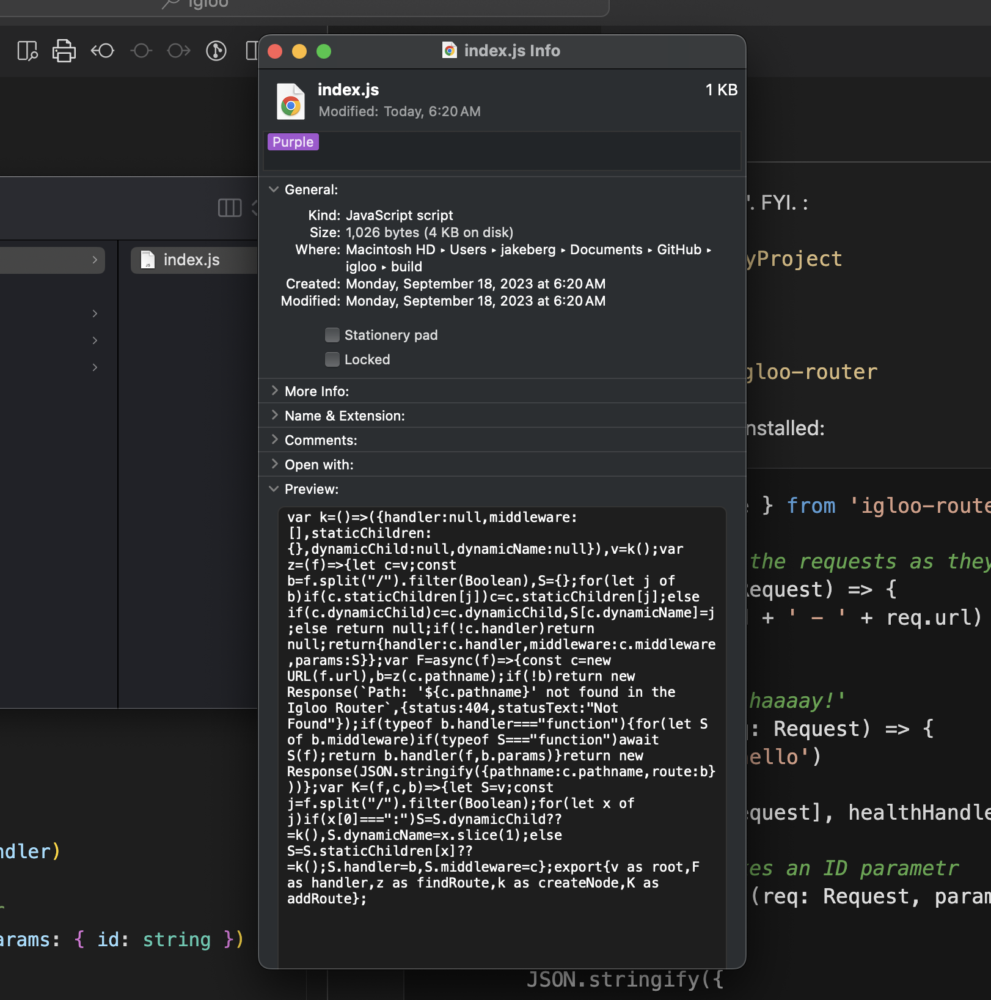

_This code is not "production ready," btw._

Create your project folder: `mkdir myProject`

Initialize bun: `bun init`

Install the Igloo-Router: `bun add igloo-router`

Copy this code to get basic routing installed:

```javascript
import { handler, addRoute } from 'igloo-router'

//dummy middleware to log the requests as they come in
const logRequest = (req: Request) => {
    console.log(req.method + ' - ' + req.url)
}

//handler that just says 'haaaay!'
const healthHandler = (req: Request) => {
    return new Response('hello')
}
addRoute('/health', [logRequest], healthHandler)

//another handler that takes an ID parametr
const randomJsonHandler = (req: Request, params: { id: string }) => {
    return new Response(
        JSON.stringify({
            success: true,
            id: params.id,
        })
    )
}
addRoute('/random-json/:id', [logRequest], randomJsonHandler)

//startup the bun server as normal
//placing the handler into the fetch means all
//request will now float through the router
const server = Bun.serve({
    port: 3000,
    fetch: handler,
})

console.log(`Basic routing examples on http://localhost:${server.port}`)
```

# Why

Because the other guys are slow and bulky! Our uncompressed code has 1026 bytes of minified Javascript code.


